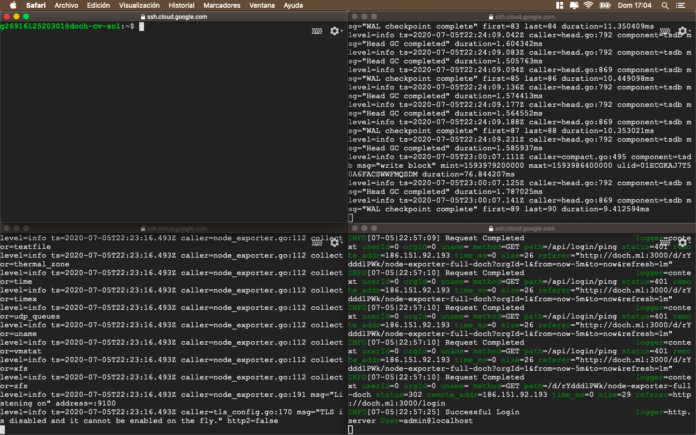

# gRPC-go-python
`python -m grpc_tools.protoc -I. --python_out=. --grpc_python_out=. coronavirus.proto`
```shell
python -m grpc_tools.protoc -I. --python_out=. --grpc_python_out=. coronavirus.proto
hola mundo ;v


df
sdf
```

1. 
* p1
1. **Hola**
    1. hola
    2. Hola
    3. gg
        - ff
        - 
        - sdf
        - 
2. GElo
* pp1
* `codigoperrro`
  

```javascript
let var = 100 +4;
```
---
# Hola mudno

## Tremendo `título`  hoal nudn ;v
### k!

- [x] hola
- [luisma](#grpc-go-python)

    pring("hola");


| Syntax      | Description |
| ----------- | ----------- |
| Header      | Title       |
| Paragraph   | Text        |


```json
{
  "firstName": "John",
  "lastName": "Smith",
  "age": 25
}
```

| Syntax      | Description | Test Text     |
| :---        |    :----:   |          ---: |
| Header      | Title       | Here's this   |
| Paragraph   | Text        | And more      |


- [gRPC-go-python](#grpc-go-python)
- [Hola mudno](#hola-mudno)
  - [Tremendo `título`  hoal nudn ;v](#tremendo-título-hoal-nudn-v)
    - [k!](#k)

